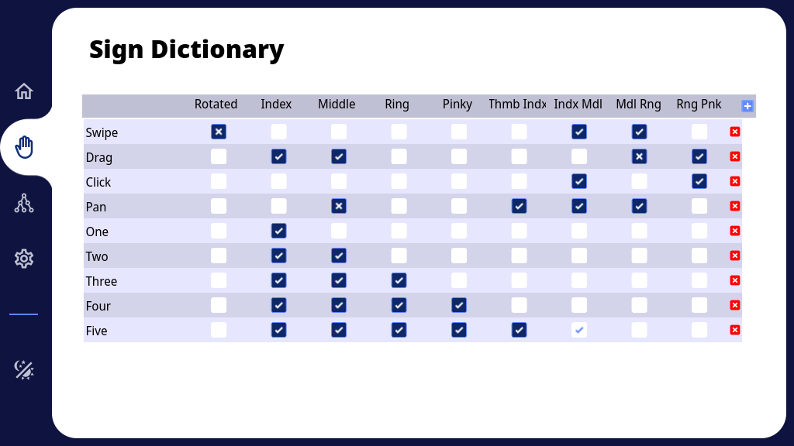
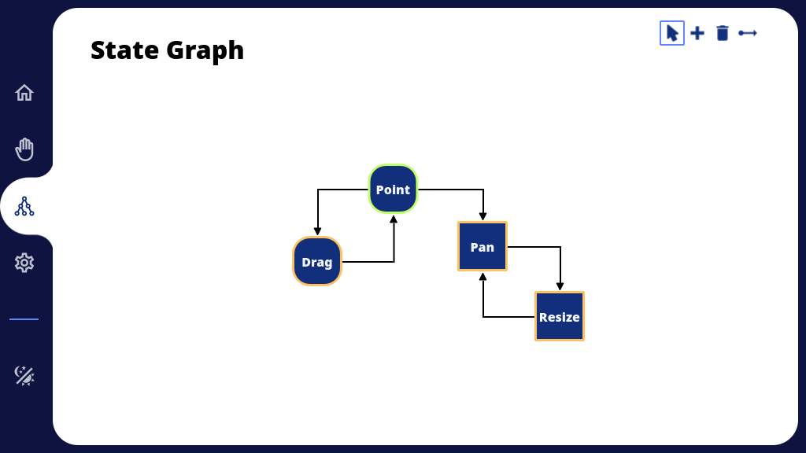
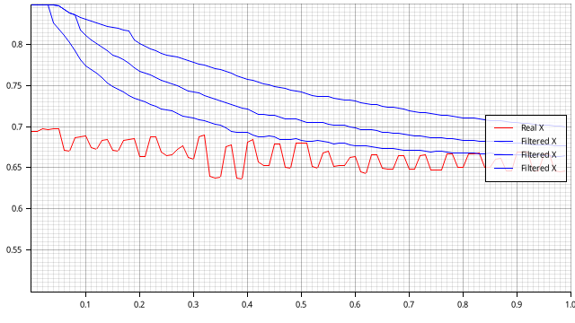

# Anthon-rs

Anthon-rs is a gesture creation and recognition program. It uses Mediapipe as a backbone for hands landmarks recognition and builds upon it with a probabilistic model to classify gestures and hand signs. Additionally, it has a neat buggy minimaistic UI built with Slint, a regretful decision.

## Instructions

1. Install build dependencies of [MediaPipe v0.10.23](https://github.com/google-ai-edge/mediapipe/tree/v0.10.23). Later versions may work, but this is what I can confirm to be functioning.
2. Run `build_libmediapipe.sh` or `build_libmediapipe.sh -g` to build with GPU support. It will automatically clone and build mediapipe.
3. Run the project `LD_LIBRARY_PATH=. LIBRARY_PATH=. cargo run --bin anthon-rs`

## Usage

1. Define the signs in the sign dictionary.

   Signs are made up of features, and every feature can have one of the three following states:
   - Must exist (Ticked)
   - Must not exist (Crossed)
   - Ignore (Leave blank)

   
2. Build a state diagram to defines the transitions between the states. 
	- Transitioning between the states is accomplished through recognizing the defined sign.
	- There are multiple types of states. They differ in mouse control and mouse capture.
	- States have events that when triggered, they do some action. The action could be to click, move the mouse, run a program, or a shell script.

	

3. Tick the enable button on the home page and have fun.

## For nerds
On request, I can provide more details about how things actually tick.

### Sneak peek of noise filtering

## Final Notes
**CREDITS:** The ui base was "borrowed" from a slint example.
